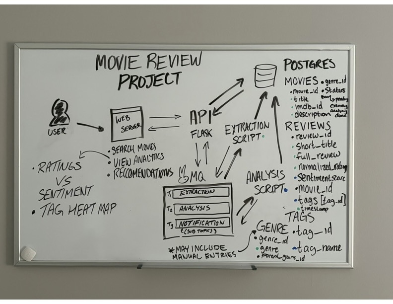
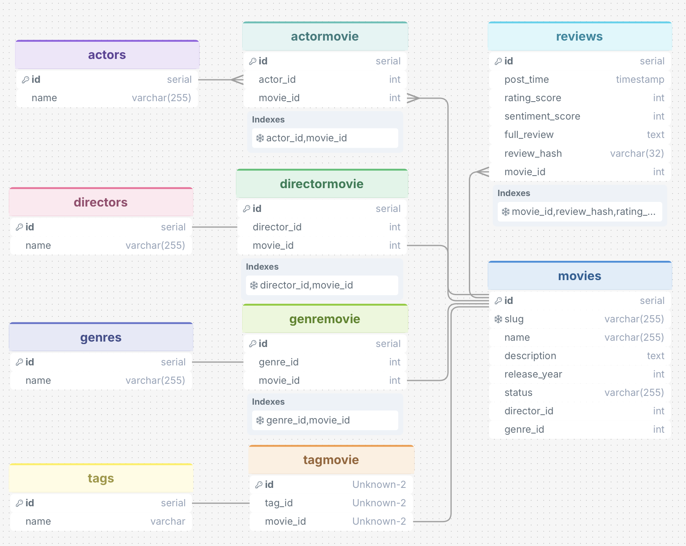
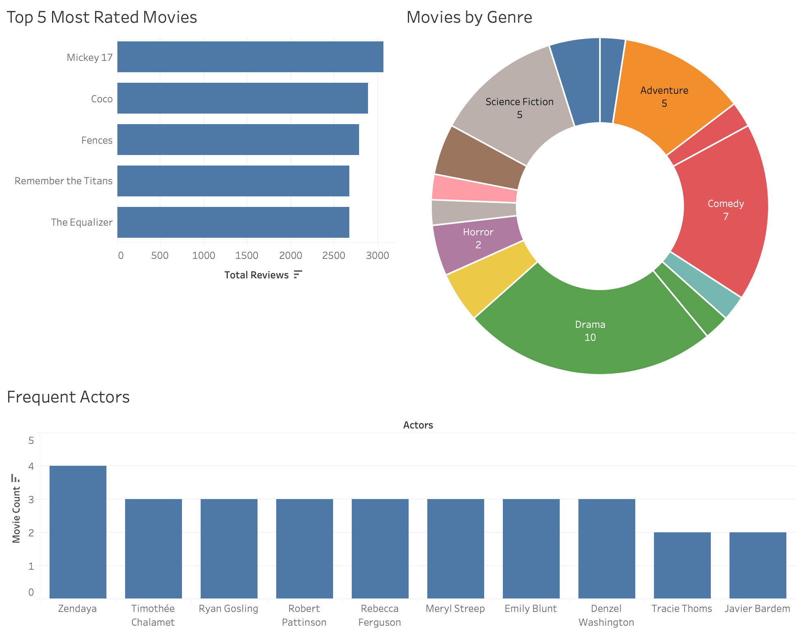
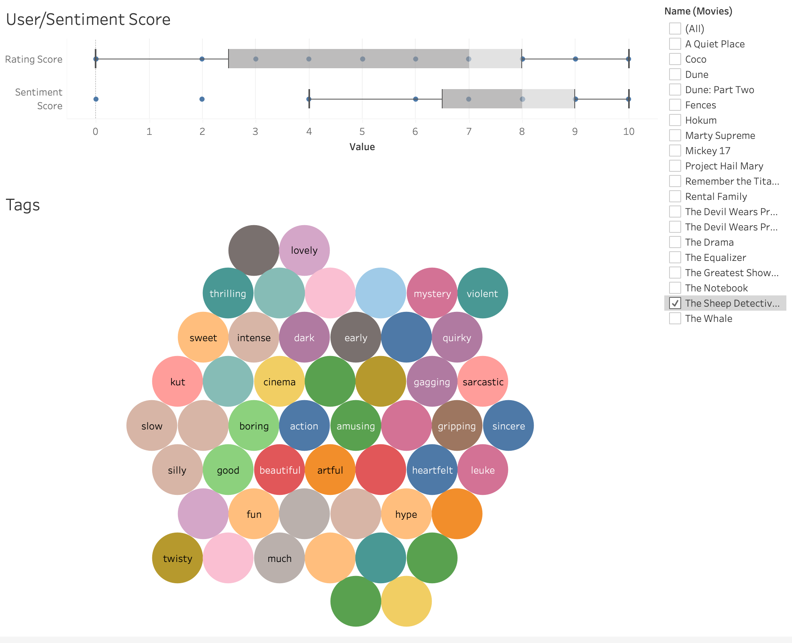

# Movie Review Project

## Overview
This project consists of extracting reviews from movie rating sites into a database, integrating an LLM to pull the actual sentiment from a review, and displaying analytics. Data will be pulled on request through a web interface. The user will be able to search for a movie, and if that movie is available it will display the appropriate analytic dashboard. Otherwise, it will find and extract the new movie. The goal of this project is to showcase my capabilites in building and designing data systems and pipelines.

I want to be able to track my prorgress and challenges, so I am documenting my progress as I go along in the Timeline & Changelog section of this document.

## Design

### Initial Design

### Database Schema

## Application Stack

**Languages:** Python, SQL

**Messaging Queue:** RabbitMQ

**Database:** PostgreSQL

**API Framework:** FastAPI

## Timeline & Changelog

### Initial commit with added extraction
At this stage, I have the basic extraction script done. It pulls movie details and reviews from the web, and imports them into a postgres database. Still needs some refinement, but it works! The database schema has deviated from the initial design. It has tables for actors, directors, genres, reviews, and movies as well as a table to link actors to movies, since movies have more than one actor and actors can be in more than one movie.

---

### Improved extract script
The script was running into issues and was difficult to troubleshoot without messages. To prevent the script from being blocked, I utilized the **curl_cffi** library to immitate a web browser and use sessions. I also implemented a random wait to more closely replicate human behavior. For the actual data, I found that some movies have multiple genres and directors, so I reworked those in a smilar fashion to the actors. So now there is are two additional tables: genremovie and directormovie. Tags will probably follow a similar structure when I add them later. Lastly, I have improved data validation and created better logging for errors. I have created a dashboard in tableau to visualize some of the data with a few movies I have added.

---

### Added analysis script
Created the analysis script that gets the reviews of a specified movie and runs the reviews through an LLM to extract a sentiment score and any relevant tags. One of the largest challenges with this script was finding a model the could quickly process a large amount of reviews with enough reasoning to provide accurate results. The other challenge was creating a prompt that would provide accurate results. Gemini's **gemini-3.1-flash-lite** model provided good results, but due to cost and usage constraints, I settled for using the **llama3.2:3b** model running locally on my laptop as it was able to provide okay results while taking about 2 seconds per review. With the addition of tags, I had to create two additional tables: tags, tagmovie. Currently it is only storing one instance of each tag, but it may be redesigned to allow multiple instance to find the most common tags among reviews. Created a dashboard in tableau to visualize the new data with a box plot comparing actual scores to the sentiment scores of their reviews and a tag bubble chart.

